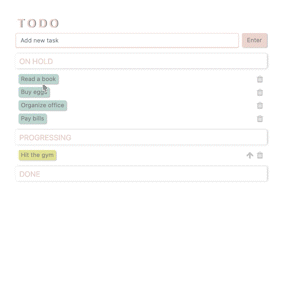
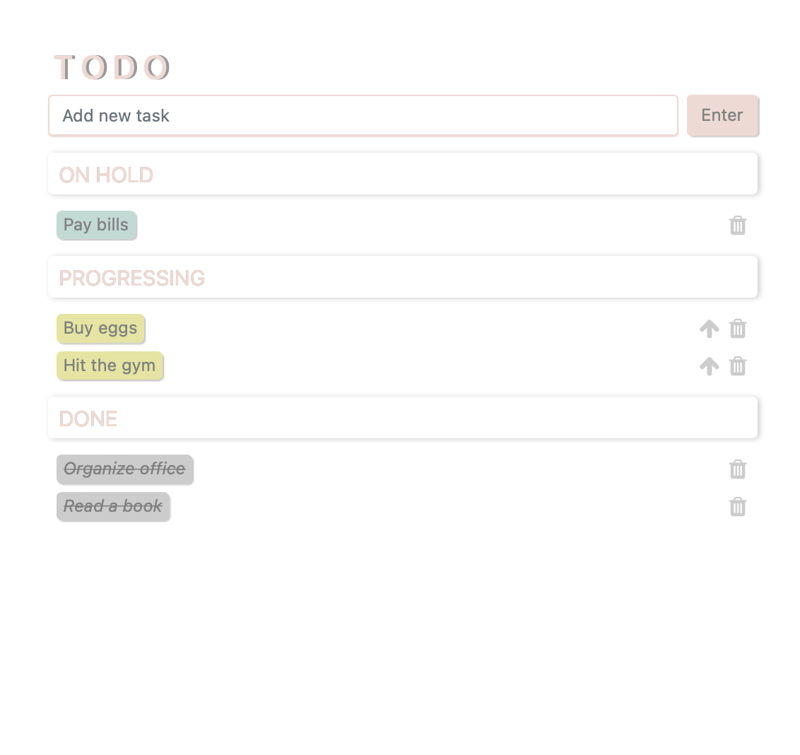
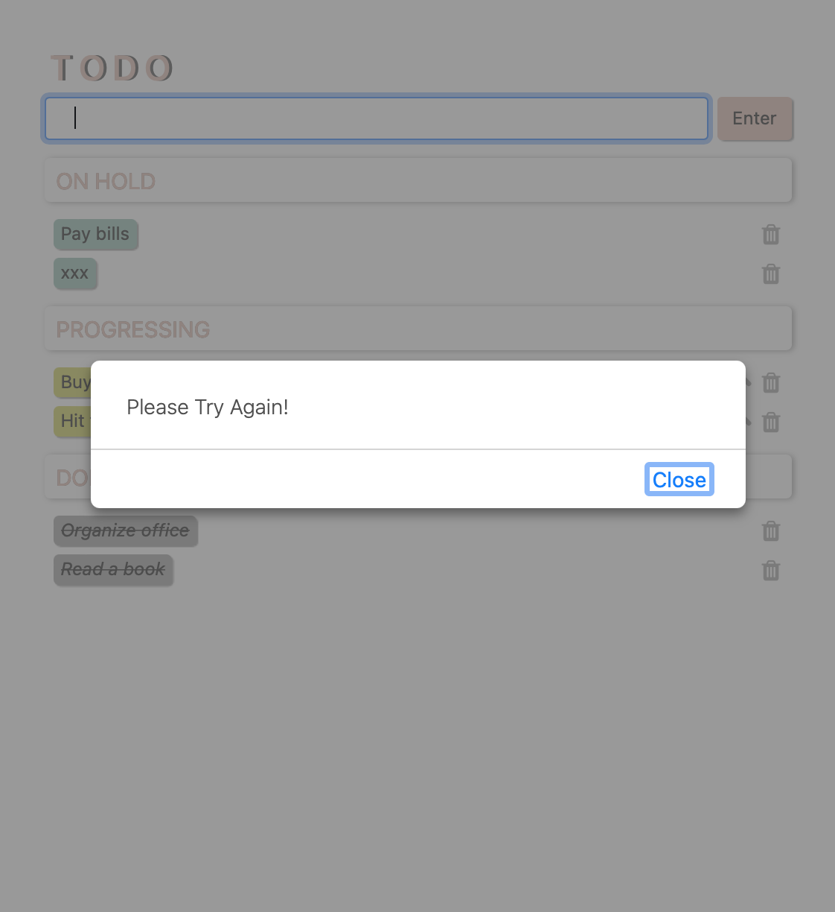

# Todo APP
This project is a basic todolist.

it's simply built with **HTML, CSS, vanilla JS**  
To try on the result, you can visit [codepen](https://codepen.io/julie424/pen/poVOjYV?editors=1111) 

Users are able to 
- add new todos to the list
- mark todos as progressing or completed
- switching any task's status 
- delete todos from the list
 

